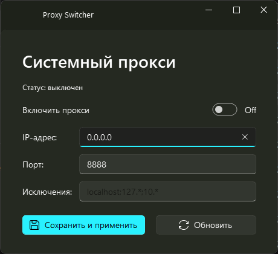

# ProxySwitcher

Небольшое Windows-приложение для быстрого включения/выключения системного
HTTP-прокси (реестр `HKCU\...\Internet Settings`) без похода в системные
настройки. Интерфейс в стиле Fluent Design (Windows 11) на базе
PyQt-Fluent-Widgets.



## Возможности

- Включение/выключение системного прокси одним тумблером
- Настройка IP-адреса, порта и списка исключений
- Мгновенное применение (через `InternetSetOption`, без перезапуска приложений)
- Не требует прав администратора (работает с `HKEY_CURRENT_USER`)

## Запуск из исходников

```
pip install PyQt5 PyQt-Fluent-Widgets
python proxy_toggle.py
```

## Сборка в один exe

```
pip install pyinstaller
pyinstaller ProxySwitcher.spec
```

Готовый файл появится в `dist/ProxySwitcher.exe`.
